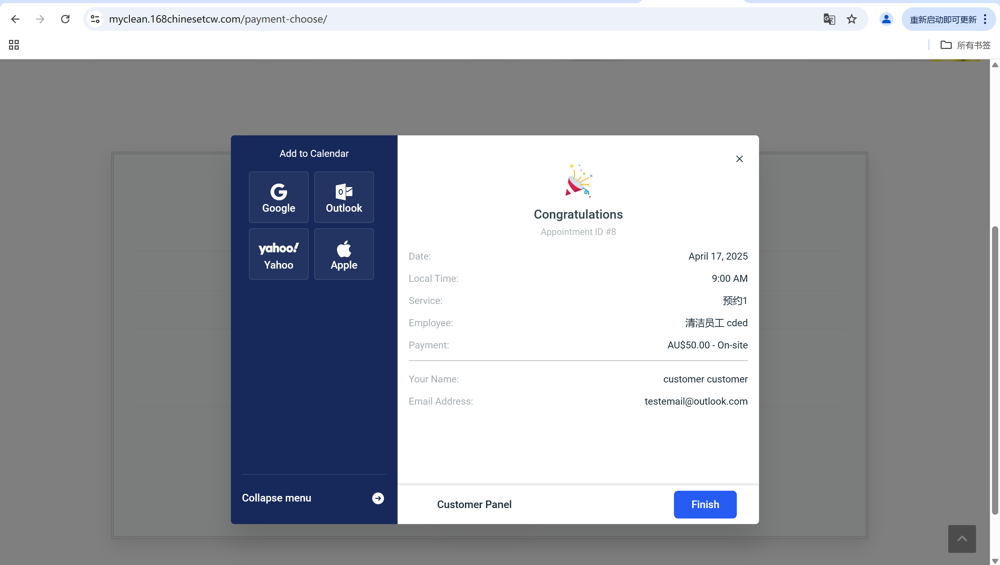

# User Story Title: Receipt After Payment  
Other versions: Payment Confirmation / Transaction Record  

---

## Priority: 6  
MoSCoW Category: Should-Have  
Iteration: Iteration 2  

This feature provides customers with a visual and downloadable receipt after completing payment, enhancing trust and record-keeping.  

---

## Estimation: 2 days  
Developer: Yandong Jiang  
Effort estimate: 2 days  

---

## Assumptions:  
- Receipts are automatically generated once payment (online or onsite) is successful  
- Receipt displays service, cleaner, amount paid, and customer details  
- Users can review or download receipts from confirmation panel or dashboard  
- This version only supports basic receipt view (no downloadable PDF yet)  

---

## Description:  
### Description-v1:  
As a customer, I want to receive an invoice/receipt after payment, so that I can keep a record of my transactions.  

### Description-v2:  
The system should:  
- Display a confirmation page with receipt details after booking payment  
- Show Appointment ID, Date, Time, Cleaner Name, Service Name, and Amount  
- Indicate payment method used (Onsite / Stripe)  
- Include customer name and email  
- Optionally allow adding appointment to calendar (Google, Apple, Outlook)  

---

## Tasks (See Chapter 4):  
1. Design receipt confirmation panel with booking + payment data – 0.5 day  
2. Populate dynamic values from appointment object – 0.5 day  
3. Integrate “Add to Calendar” functionality – 0.5 day  
4. Test both Stripe and On-site payment receipt displays – 0.5 day  

---

## UI Design:  
Screenshots of implemented receipt/confirmation page:

**Receipt Panel after Payment:**  

---

## Completed:  
- [x] Receipt confirmation panel shows all required info  
- [x] “Add to Calendar” integration tested  
- [x] Works with both Stripe and onsite payment methods  
- [x] Screenshots saved to images folder for documentation  

Website URL for live version:  
https://myclean.168chinesetcw.com/payment-choose/

---
