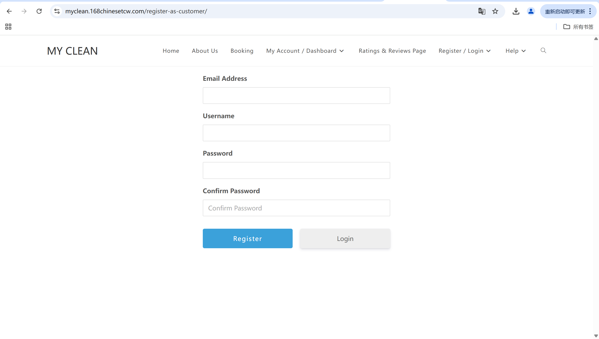
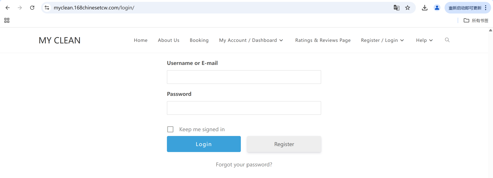

# User Story Title: Registration & Authentication  
Other versions: Sign Up / Sign In, Email or Phone Login  

---

## Priority: 1  
MoSCoW Category: Must-Have  
Iteration: Iteration 1  
This is an essential feature that allows customers to register, log in, and use the booking system securely.

---

## Estimation: 3 days  
Developer: Yandong Jiang  
Estimated time: 3 days  

---

## Assumptions:
- Users can register and log in using email or phone number  
- Phone login uses simulated SMS code (mock)  
- Social login (e.g., Google/Facebook) is not included in this version  
- The system keeps users logged in until they manually log out  

---

## Description:

### Description-v1:  
As a customer, I want to register and log in (via email or phone), so that I can securely access and manage my cleaning bookings.

### Description-v2 (after sprint planning):  
The system should allow customers to:  
- Register using email/password or phone number  
- Log in using their registered credentials  
- Access the dashboard after logging in  
- Stay logged in unless the user chooses to log out

---

## Tasks (See Chapter 4):
1. Design UI for Register and Login pages – 0.5 day  
2. Implement registration and login logic – 1 day  
3. Add validation for input fields (email format, required password, etc.) – 0.5 day  
4. Implement mock SMS verification (if phone login is used) – 0.5 day  
5. Ensure the system remembers logged-in users – 0.5 day  

---

## UI Design:

Below are screenshots of the implemented UI:

**Register Page**  

**Login Page**  

**Password Reset Page**  

Live site:  
 https://myclean.168chinesetcw.com/register-as-customer/

---

## Completed:

- [x] Register page completed and deployed  
- [x] Login page implemented with basic validation  
- [x] Login redirects to dashboard  
- [x] Password reset UI page added  
- [x] UI screenshots included in GitHub `images/` folder  

---

