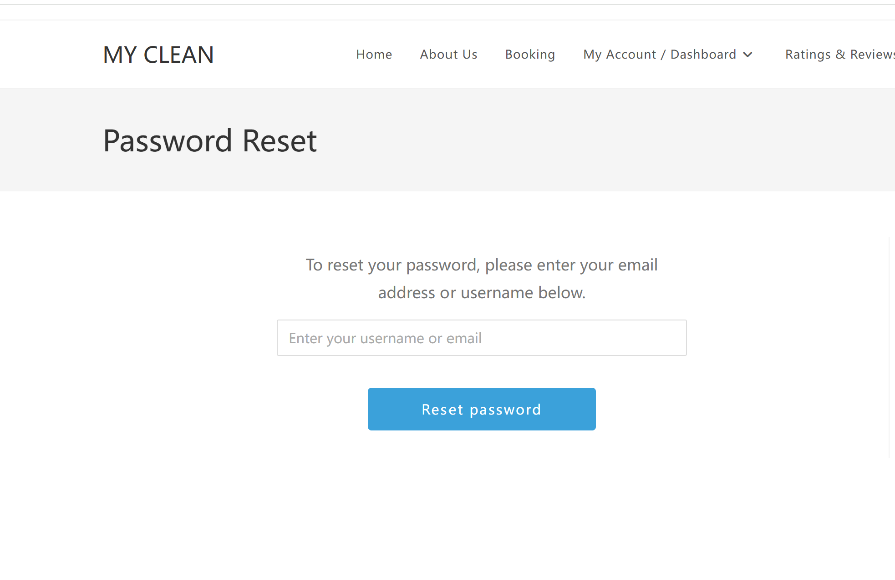
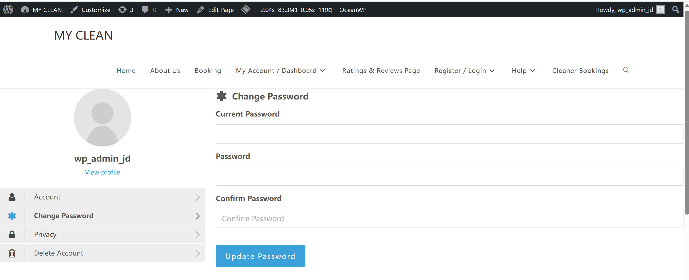

# User Story Title: Reset Password  
Other versions: Forgot Password, Password Recovery via Email or SMS  

---

## Priority: 2  
MoSCoW Category: Must-Have  
Iteration: Iteration 1  
Password reset is essential for user accessibility and account security. It allows users to regain access if they forget their credentials.

---

## Estimation: 1 day  
Developer: Yandong Jiang  
Estimated time: 1 day  

---

## Assumptions:
- Users can reset password via email link or mock SMS code  
- The reset page must verify that the user is real (e.g., email exists)  
- Reset link or code must be valid for a limited time  
- Confirmation and validation messages are displayed  
- After reset, users can log in using the new password  

---

## Description:

### Description-v1:  
As a customer, I want to reset my password (via email or SMS), so that I can regain access if I forget my credentials.

### Description-v2 (after planning):  
The system allows users who forgot their password to:  
- Enter their email or phone number  
- Receive a reset link or code  
- Set a new password  
- Log in again with the updated password

---

## Tasks (See Chapter 4):
1. Create "Forgot Password" UI – 0.3 day  
2. Implement backend email or mock SMS password reset logic – 0.3 day  
3. Add validation (email exists, code matches) – 0.2 day  
4. Build password update form with confirmation – 0.2 day  

---

## UI Design:

**Password Reset Request Page**  
This is where users enter their email to request a reset link.

 Live page:  
https://myclean.168chinesetcw.com/?page_id=131/password/

Screenshot:  

---

**Change Password Page**  
Screenshot:  

---

## Completed:

- [x] Password reset page UI created  
- [x] Change password form implemented  
- [x] Input validation added  
- [x] Screenshots inserted into GitHub `images/` folder  

---

