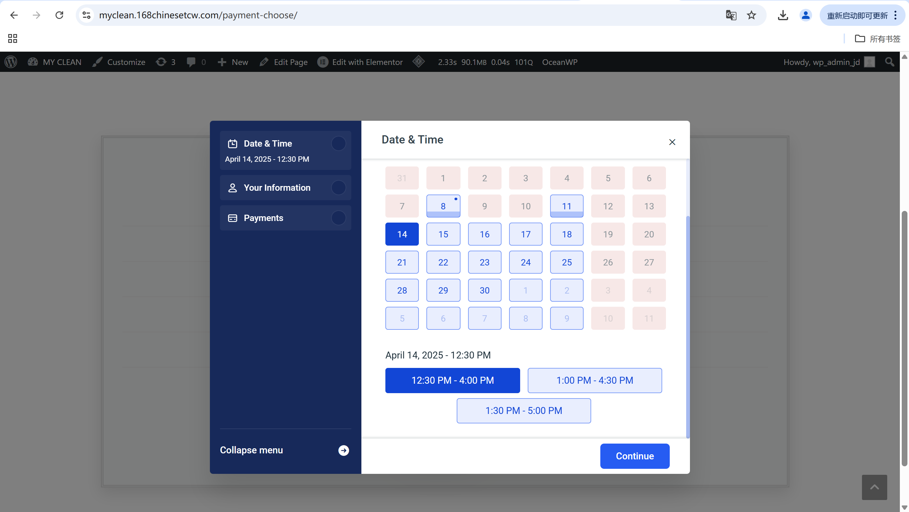

# User Story Title: Book a Cleaning Service  
Other versions: Make a booking, Select date & time for service  

---

## Priority: 3  
MoSCoW Category: Must-Have  
Iteration: Iteration 1  
This feature allows customers to schedule cleaning services at their convenience, which is core to the purpose of the platform.

---

## Estimation: 5 days  
Developer: Yandong Jiang  
Estimated time: 5 days  

---

## Assumptions:
- Customers can choose a service package (price)  
- Booking flow includes date and time selection  
- The system prevents double booking (only available slots shown)  
- After booking, the customer sees a confirmation screen  
- Cleaner and customer receive email confirmation (or mock notification)  

---

## Description:

### Description-v1:  
As a customer, I want to book a cleaning service by selecting date, time, and service package, so that I can schedule an appointment at my convenience.

### Description-v2 (after sprint planning):  
Customers can:  
- Choose from available pricing/service plans  
- Select preferred date and time using a calendar interface  
- Enter personal contact details  
- Confirm the booking and receive confirmation  

---

## Tasks (See Chapter 4):
1. Design booking interface for date/time and service plan – 1 day  
2. Implement interactive calendar UI – 1.5 days  
3. Add form validation and field checking – 0.5 day  
4. Build backend logic to store bookings and prevent overlap – 1 day  
5. Connect to email/mock notification system – 1 day  

---

## UI Design:

**Service Packages Page**  
Where users choose their cleaning plan.

Live page:  
https://myclean.168chinesetcw.com/payment-choose/

Screenshot:  

---

**Date Selection Interface**  
User selects available service date.

Screenshot:  

---

**Time Slot Selection**  
User picks the preferred time slot after date selection.

Screenshot:  

---

## Completed:

- [x] Booking UI created and tested  
- [x] Date and time picker fully functional  
- [x] Booking saved and confirmed  
- [x] Screenshots added to GitHub `images/` folder  

---

