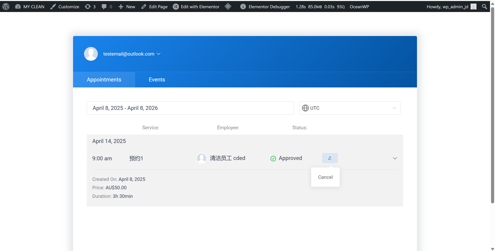
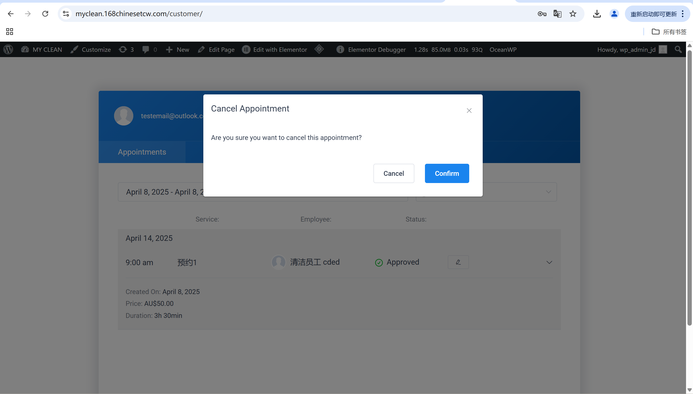
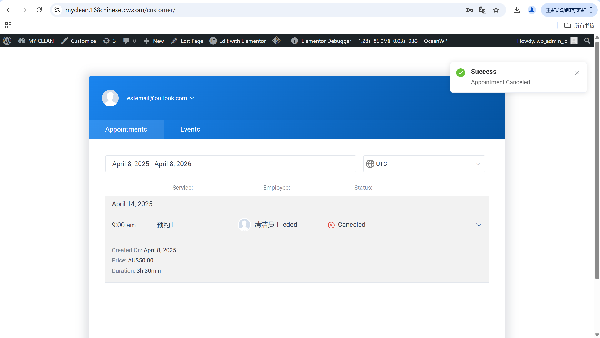

# User Story Title: Modify or Cancel Booking  
Other versions: Cancel scheduled service, Reschedule cleaning  

---

## Priority: 4  
MoSCoW Category: Must-Have  
Iteration: Iteration 1  
Allows customers to modify or cancel a scheduled appointment when plans change, enhancing flexibility and user satisfaction.

---

## Estimation: 3 days  
Developer: Yandong Jiang  
Estimated time: 3 days  

---

## Assumptions:
- Only bookings within valid time window can be changed/canceled  
- Confirmation step must be present to avoid accidental cancellation  
- After cancellation, appointment status updates and email/notification is sent  
- Cleaners will be notified of cancellation or schedule change  

---

## Description:

### Description-v1:  
As a customer, I want to modify or cancel my booking (within a valid time window), so that I can handle changes in my schedule.

### Description-v2 (after planning):  
Customers can:  
- View a list of their upcoming bookings  
- Click "Cancel" or "Edit" on a booking card  
- Confirm cancellation through a popup modal  
- Get visual feedback that the cancellation was successful  
- See updated status reflected in their dashboard  

---

## Tasks (See Chapter 4):
1. Add “Cancel” button to booking cards – 0.5 day  
2. Add confirmation popup before cancel – 0.5 day  
3. Update booking status to “Canceled” in backend – 0.5 day  
4. Show updated status on dashboard – 0.5 day  
5. Notify user (email / message or in-page alert) – 1 day  

---

## UI Design:

**Appointment Dashboard View**  
Shows upcoming bookings with cancel option.

Screenshot:  

---

**Cancellation Confirmation Modal**  
Popup to confirm user's action.

Screenshot:  

---

**Post-Cancellation View**  
Status is updated to “Canceled”, and a success message appears.

Screenshot:  

---

## Completed:

- [x] Cancel button added and functional  
- [x] Confirmation step integrated  
- [x] Status update and success feedback shown  
- [x] Screenshots included in GitHub `images/` folder  

---

