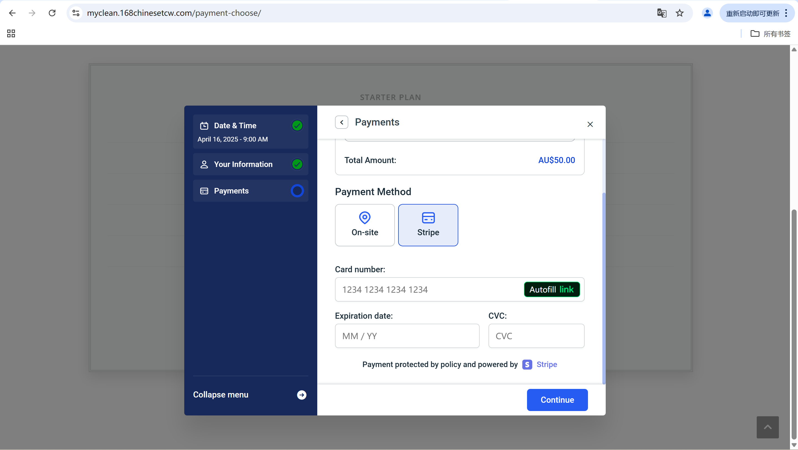
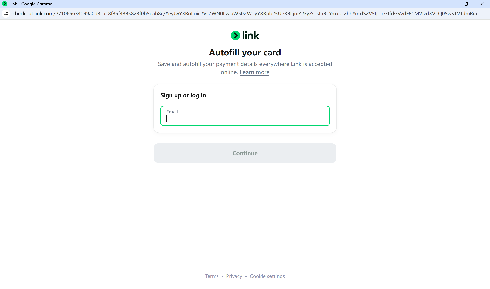
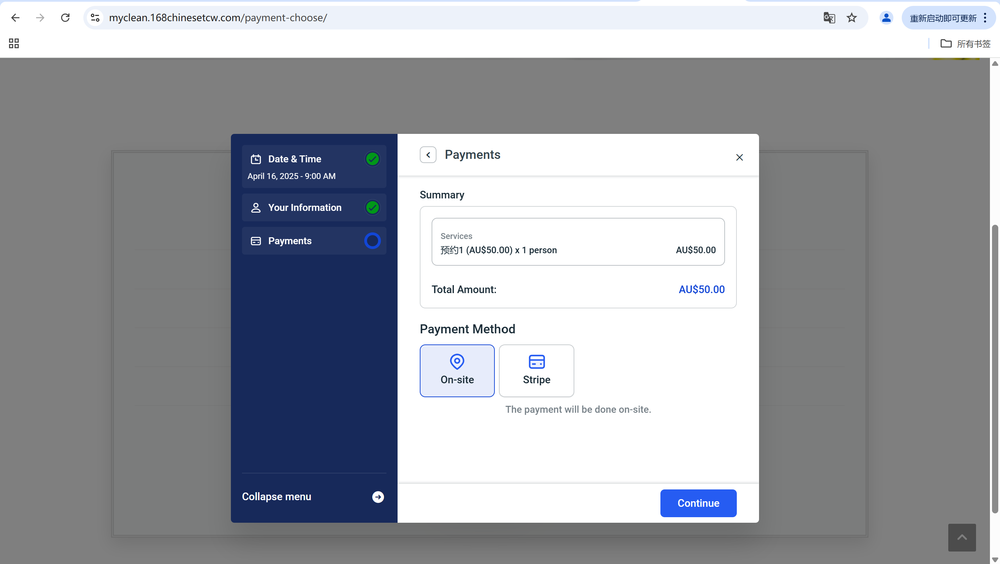

# User story title: Online Payment with Stripe or PayPal Mock API

Keep any other version here as well, e.g. Choose payment method, simulate Stripe/PayPal transaction.

---

**Priority**: 5 

Essential for completing the booking workflow. Enables secure and contactless payments.

---

**Estimation**: 5 days

Planning poker numbers:

- Yandong: 5 days (estimated before iteration-1)

---

**Assumptions (if any)**:

- Payment methods include Stripe (demo) and On-site (mock).
- No actual card transaction is required in development stage.

---

**Description**: The system will let customers choose payment method (Stripe or On-site) and complete payment online without using cash.

You need to keep all versions here so that your instructor/marker can see your changes easily. In a real project, your older versions could be viewed via commits.

**Description-v1**: The user will be able to pay using Stripe test cards or select on-site mock payment.

---

## Tasks, see chapter 4.

1. Integrate payment method options (Stripe and On-site), Estimation: 2 days  
2. Connect mock Stripe API (test cards only), Estimation: 2 days  
3. UI validation and form testing, Estimation: 1 day  

---

## UI Design:

Screenshots of user interface implemented with Elementor + Stripe test plugin.

**Payment method selection page**  

**Autofill your card - Stripe demo link page**  

**On-site payment selected (mock option)**  

---

## Completed:

- Stripe test card form with validation  
- Demo payment options with price summary  
- No actual charge occurred  
- Function tested and confirmed  

---

Page URL:  
[https://myclean.168chinesetcw.com/payment-choose/](https://myclean.168chinesetcw.com/payment-choose/)

