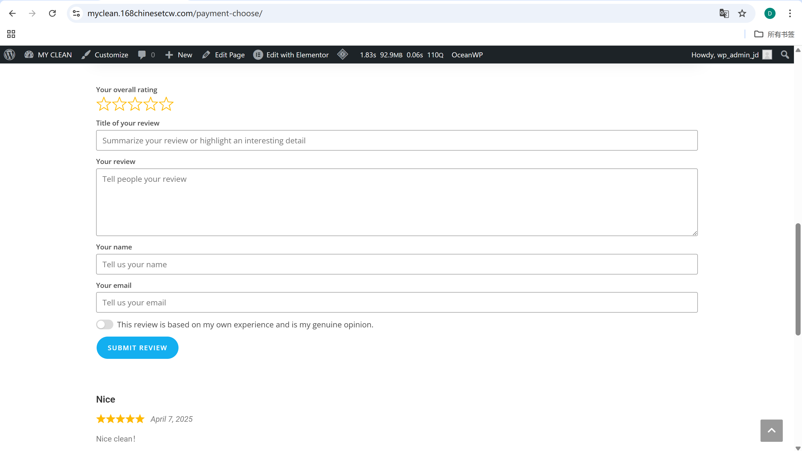
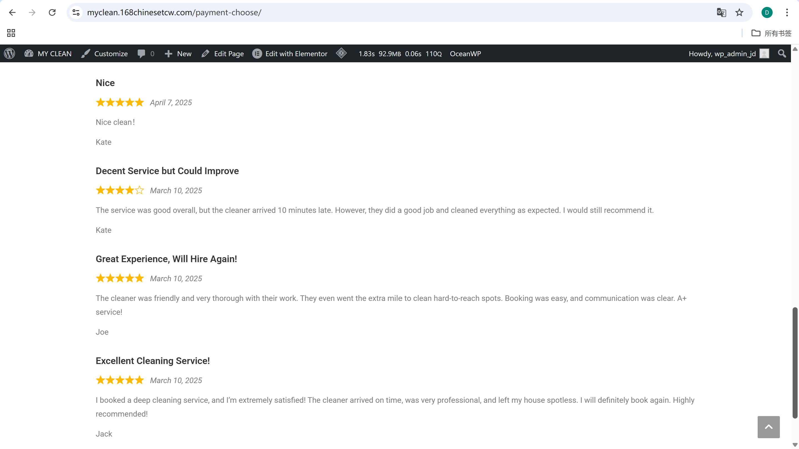

# User Story Title: Customer Review and Rating  
Other versions: Submit review after service, Give feedback to cleaner  

---

## Priority: 7  
MoSCoW Category: Should-Have  
Iteration: Iteration 2  
Allows customers to provide feedback on service quality and help others make informed choices when selecting cleaners.

---

## Estimation: 3 days  
Developer: Yandong Jiang  
Estimated time: 3 days  

---

## Assumptions: 
- Reviews are published immediately without admin moderation
- Reviews include basic fields: rating, title, content, name, email 
- Admin can moderate inappropriate reviews  

---

## Description:

### Description-v1:  
As a customer, I want to rate and review the cleaner after the service is completed, so that I can help others make informed decisions and provide feedback.

### Description-v2 (after planning):  
Customers can:  
- See a review form with star rating, title, content, name, email  
- Submit their review after a service ends  
- View all past reviews publicly displayed below the form  
- All reviews are sorted by date  

---

## Tasks (See Chapter 4):
1. Display review form (rating + text fields) – 0.5 day  
2. Link form to completed bookings only – 0.5 day  
3. Store reviews with metadata (date, cleaner ID, etc.) – 1 day  
4. Display reviews below form with star rating UI – 0.5 day  
5. Enable admin moderation for flagged content – 0.5 day  

---

## UI Design:

**Review Submission Panel**  
Customer gives rating and enters feedback.

Screenshot:  

---

**Review Display Section**  
Shows all past customer reviews with name, date, and star rating.

Screenshot:  

---

## Completed:

- [x] Review form implemented  
- [x] Reviews submitted only after completion  
- [x] Display reviews below form  
- [x] Screenshots included in GitHub `images/` folder  

---

Website URL for live version:  
https://myclean.168chinesetcw.com/payment-choose/
