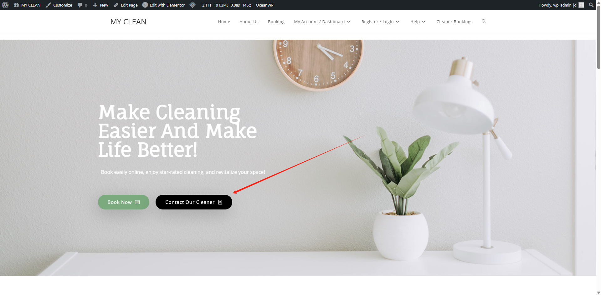
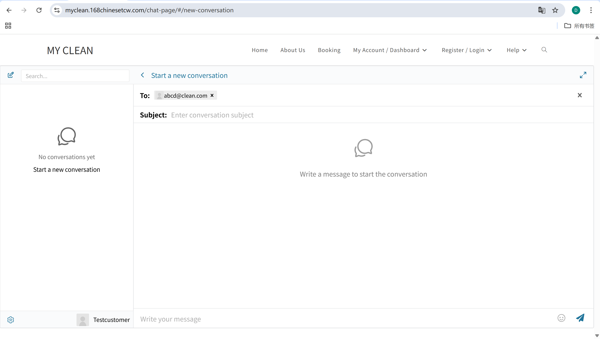
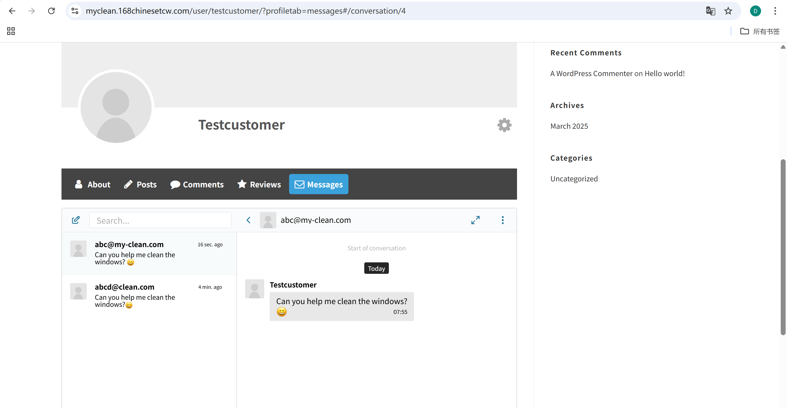
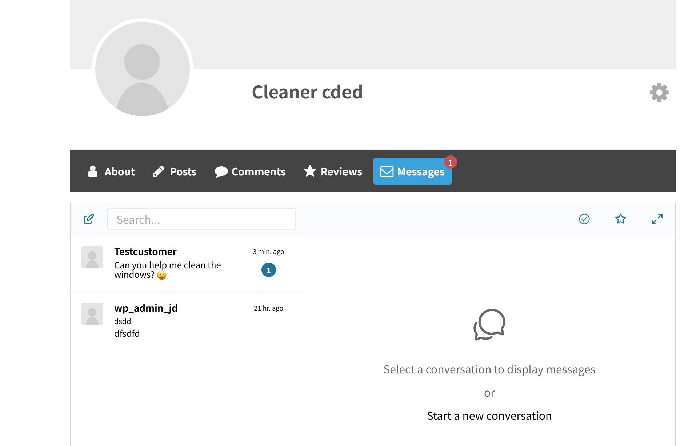
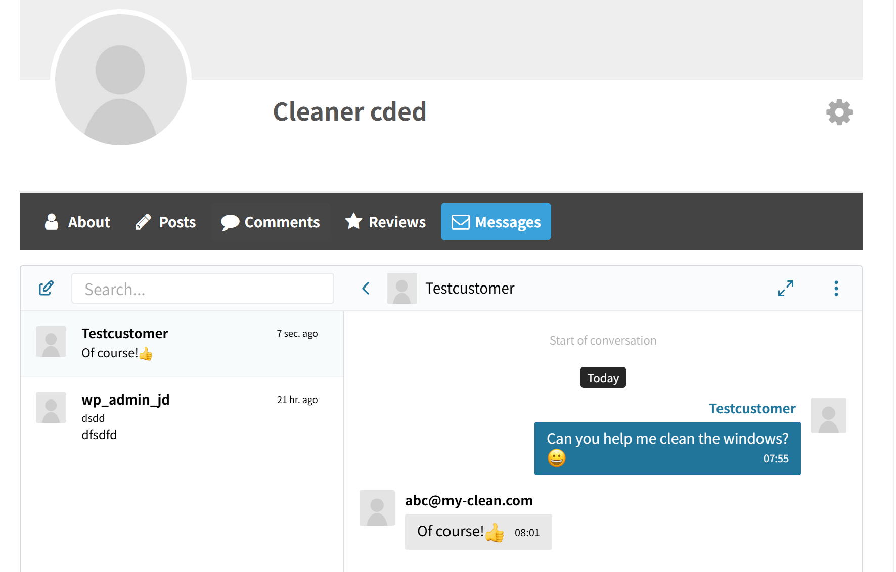

# US-08 | Could-Have | Est. 3 days  
**User Story**  
As a customer, I want to chat or message the cleaner, so that I can provide additional instructions or address any concerns.

---

**MoSCoW Priority**: Could-Have  
**Estimated Time**: 3 days  
**Developer**: Yandong Jiang

---

### Assumptions
- Both customers and cleaners must be logged in to view and send messages.
- Communication is limited to registered users with valid bookings.
- Messages are stored securely and are visible only to involved parties.

---

### Description 
  
After logging in, customers can click "Contact Our Cleaner" from the homepage to initiate a conversation. They can select a cleaner and send messages through the chat interface. Cleaners can then receive and respond to those messages from their own dashboard.

---

### Tasks Breakdown
- [x] Add "Contact Our Cleaner" button to homepage (`contact_button.png`)
- [x] Design conversation interface (`contact_interface.png`)
- [x] Enable customer to send a message (`customer_send_message.png`)
- [x] Show new message in cleaner dashboard (`cleaner_receive_message.png`)
- [x] Enable cleaner to reply (`cleaner_reply_message.png`)

---

### UI Screenshot & Description
| Screenshot | Description |
|------------|-------------|
|  | Homepage button allowing customer to initiate private messaging. |
|  | New conversation interface to select cleaner and send a message. |
|  | Customer has sent a message to the selected cleaner. |
|  | Cleaner dashboard shows new unread message from customer. |
|  | Cleaner opens and replies to customer message. |

---

### Completion Criteria 
- [x] Customers can start a new conversation from homepage
- [x] Chat interface loads with recipient selection
- [x] Messages can be sent and received in real time
- [x] Cleaners can reply through their dashboard
- [x] Interface shows message history per user

---

### Suggested Navigation Path
`Homepage > Contact Our Cleaner → Chat Interface → Message Sent/Received`

---

### Deployment Notes
Ensure Ultimate Member messaging module is enabled. Test message flow between different user roles (customer and cleaner). Disable message option for unverified cleaners if needed.

