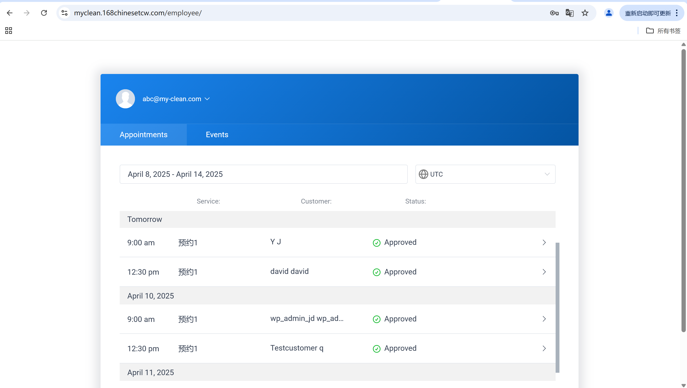

# User Story Title: View Upcoming Bookings  
Other versions: Cleaner dashboard view, Appointment schedule  

---

## Priority: 4  
MoSCoW Category: Must-Have  
Iteration: Iteration 1  
Allows cleaners to check their upcoming appointments with essential details, ensuring they can plan their work schedule effectively.

---

## Estimation: 4 days  
Developer: Yandong Jiang  
Estimated time: 4 days  

---

## Assumptions:
- Only authenticated cleaners can access this view  
- Information includes date, time, customer, and status  
- View is dynamically updated as bookings are added/canceled  
- Sorting is chronological (earliest upcoming bookings first)  

---

## Description:

### Description-v1:  
As a cleaner, I want to view all my upcoming bookings (including date, time), so that I can plan my work schedule efficiently.

### Description-v2 (after planning):  
Cleaners can:  
- Log in to their dashboard  
- Access a calendar or list view showing all approved appointments  
- See details such as service time, customer name, and booking status  
- Scroll or filter by date for efficient schedule management  

---

## Tasks (See Chapter 4):
1. Implement cleaner login and dashboard view – 1 day  
2. Fetch upcoming bookings from backend based on cleaner ID – 1 day  
3. Display booking cards in list format with all info – 1 day  
4. Add pagination or scroll support for longer lists – 0.5 day  
5. Test updates after cancellations or schedule changes – 0.5 day  

---

## UI Design:

**Cleaner Dashboard - Upcoming Bookings**  
List of confirmed future appointments sorted by time.
Screenshot:  

---

## Completed:

- [x] Cleaner dashboard view implemented  
- [x] Backend filtering by assigned cleaner  
- [x] Booking list shows date/time/customer/status  
- [x] Screenshot included in GitHub `images/` folder  

---

Website URL for live version:  
https://myclean.168chinesetcw.com/employee/

