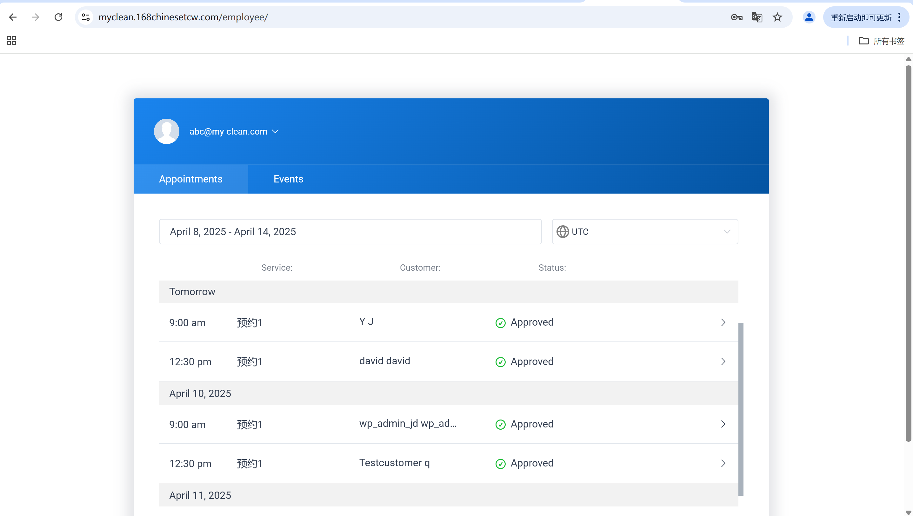

# User Story Title: Accept or Decline Bookings  
Other versions: Cleaner confirms availability, Manage workload  

---

## Priority: 10  
MoSCoW Category: Must-Have  
Iteration: Iteration 1  
Allows cleaners to accept or decline new cleaning requests based on availability, helping avoid scheduling conflicts.

---

## Estimation: 2 days  
Developer: Yandong Jiang  
Estimated time: 2 days  

---

## Assumptions:
- Only pending (new) bookings will have accept/decline options  
- Accepted bookings will be locked to cleaner  
- Declined bookings will notify customer to rebook or switch cleaner  
- Actions must be confirmed with visual status update and stored in backend  
- Admin has full visibility of status  

---

## Description:

### Description-v1:  
As a cleaner, I want to accept or decline new booking requests, so that I can manage my availability based on my workload.

### Description-v2 (after planning):  
Cleaners can:  
- View list of upcoming and pending bookings  
- Accept or Decline a request  
- See immediate visual update of booking status (e.g., "Approved", "Canceled")  
- Backend stores status; customers are notified of decision  

---

## Tasks (See Chapter 4):
1. Add booking status selector dropdown for cleaners – 0.5 day  
2. Add logic to update status backend on click – 0.5 day  
3. Visual UI updates (icons & status colors) – 0.5 day  
4. Notification or in-app feedback to customer – 0.5 day  

---

## UI Design:

**Pending & Approved View**  
Cleaner dashboard showing all bookings (approved and pending).

Screenshot:  

---

**Booking Detail (Cleaner View)**  
Cleaner sees full customer info, date/time, and current status.

Screenshot:  

---

**Edit Booking Panel (Cleaner)**  
Cleaner can approve, reject or mark booking status.

Screenshot:  

---

**Canceled Booking (Cleaner View)**  
Once declined, the booking is marked as “Canceled”.

Screenshot:  
.png)

---

## Completed:

- [x] Status dropdown implemented with Accept/Decline  
- [x] Booking status updates correctly reflected in DB  
- [x] Dashboard shows updated statuses  
- [x] Screenshots included in GitHub `images/` folder  

---

Website URL for live version:  
https://myclean.168chinesetcw.com/employee/
