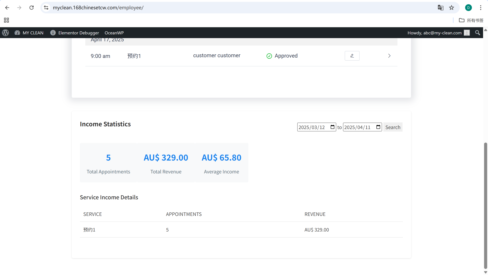

# User Story Title: Cleaner Income Tracking  
Other versions: Earnings overview, Revenue statistics, Payment monitoring

---

## Priority: 11  
MoSCoW Category: Must-Have  
Iteration: Iteration 1  
Allows cleaners to view and monitor their income from completed appointments, supporting transparency and financial tracking.

---

## Estimation: 3 days  
Developer: Yandong Jiang  
Estimated time: 3 days  

---

## Assumptions:
- Income is calculated based on completed and approved appointments  
- Cleaners can access income stats by week/month  
- Data includes number of appointments, total revenue, average income  
- Filter options by date range  
- Access restricted to logged-in cleaners only  

---

## Description:

### Description-v1:  
As a cleaner, I want to track my earnings (weekly or monthly), so that I can monitor my income from the platform.

### Description-v2 (after planning):  
Cleaners can:  
- Log in to their employee portal  
- Navigate to the Income Statistics section  
- View total number of appointments completed  
- See the corresponding total and average revenue  
- Filter statistics by date range  
- Review income by service type  

---

## Tasks (See Chapter 4):
1. Add “Income Statistics” module to cleaner dashboard – 1 day  
2. Implement data aggregation by date and service – 0.5 day  
3. Create filter controls for weekly/monthly view – 0.5 day  
4. Display key metrics: total revenue, average income – 0.5 day  
5. Style layout for visual clarity – 0.5 day  

---

## UI Design:

**Cleaner Dashboard – Income Report Panel**  
Shows earnings by time period and service type.

Screenshot:  

---

## Completed:

- [x] Income panel implemented in employee dashboard  
- [x] Revenue stats and date filter functional  
- [x] Data grouped by service  
- [x] Screenshot saved in GitHub `images/` folder  

---

Website URL for live version:  
https://myclean.168chinesetcw.com/employee/
