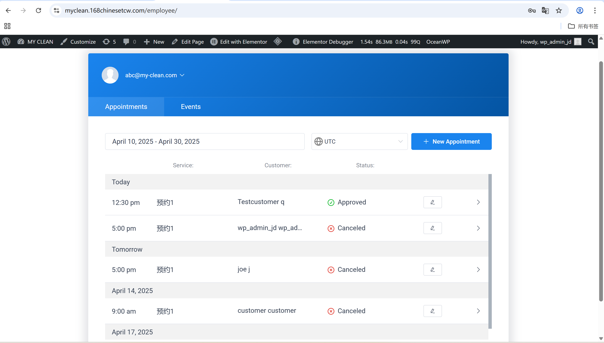

# User Story Title: Google Calendar Sync  
Other versions: Avoid missed jobs, External calendar integration  

---

## Priority: 12  
MoSCoW Category: Should-Have  
Iteration: Iteration 2  
Allows cleaners to sync their appointments with Google Calendar to prevent double bookings and missed jobs.

---

## Estimation: 2 days  
Developer: Yandong Jiang  
Estimated time: 2 days  

---

## Assumptions:
- Cleaners use Google Calendar for personal/work schedule  
- Calendar sync happens one-way (from system to Google)  
- Only “Approved” bookings are synced  
- Google authentication and permission are granted once by cleaner  

---

## Description:

### Description-v1:  
As a cleaner, I want to sync my schedule with Google Calendar, so that I can avoid double-booking or missing appointments.

### Description-v2 (after planning):  
Cleaners can:  
- Click “Add to Calendar” after accepting booking  
- Choose Google, Outlook, or Apple calendar  
- Instantly add appointment details into selected calendar  
- Prevent overlapping with personal/work schedule  

---

## Tasks (See Chapter 4):
1. Integrate calendar export options in booking detail modal – 0.5 day  
2. Add ICS/Google link generation logic – 0.5 day  
3. Enable event push to Google Calendar API – 0.5 day  
4. Show visual feedback (success/failure) – 0.5 day  

---

## UI Design:

**Calendar Sync Panel**  
Cleaners can sync any confirmed appointment to external calendar systems.

Screenshot:  

---

**Cleaner Appointment Panel**  
From here, cleaners can open booking details and sync.

Screenshot:  
.png)

---

## Completed:

- [x] Calendar sync option integrated  
- [x] Calendar links tested  
- [x] Only confirmed jobs synced  
- [x] Screenshots saved in `images/` folder  
- [x] Visible on cleaner dashboard  

---

Website URL for live version:  
https://myclean.168chinesetcw.com/employee/

---
