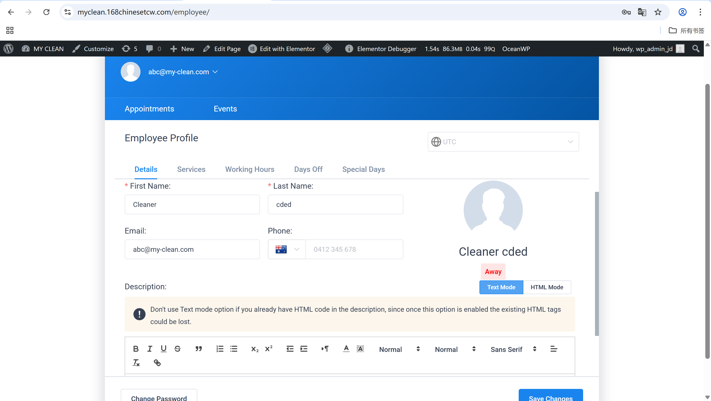

# User Story Title: Cleaner Profile Introduction  
Other versions: Upload professional info, Add cleaner bio  

---

## Priority: 13  
MoSCoW Category: Should-Have  
Iteration: Iteration 2  
Allows cleaners to upload their introduction and credentials, improving transparency and building customer trust.

---

## Estimation: 3 days  
Developer: Yandong Jiang  
Estimated time: 3 days  

---

## Assumptions:
- Cleaners can only edit their own profile  
- Admin can review or moderate cleaner bios  
- Basic formatting (text + HTML mode) is supported  
- Bio field is optional but strongly encouraged  

---

## Description:

### Description-v1:  
As a cleaner, I want to upload my introduction to my profile, so that customers trust my professional qualifications.

### Description-v2 (after planning):  
Cleaners can:  
- Access their profile via the Employee Panel  
- Edit name, phone, description and service settings  
- Add a bio/intro using text editor (supports formatting or HTML)  
- Save changes and preview them instantly on their profile  
- Update content later if needed  

---

## Tasks (See Chapter 4):
1. Add profile editing UI for cleaners – 1 day  
2. Enable text + HTML mode input for description – 0.5 day  
3. Connect form to backend user profile – 0.5 day  
4. Store and display cleaner description in booking preview – 1 day  

---

## UI Design:

**Cleaner Profile Editing Panel**  
Allows input of name, contact, bio and status.

Screenshot:  

---

## Completed:
- [x] Profile editing form visible to cleaners  
- [x] Bio/intro field supports formatted text  
- [x] Data stored in backend and displayed  
- [x] Screenshot saved in `images/` folder  
- [x] Displayed correctly in employee dashboard  

---

Website URL for live version:  
https://myclean.168chinesetcw.com/employee/

