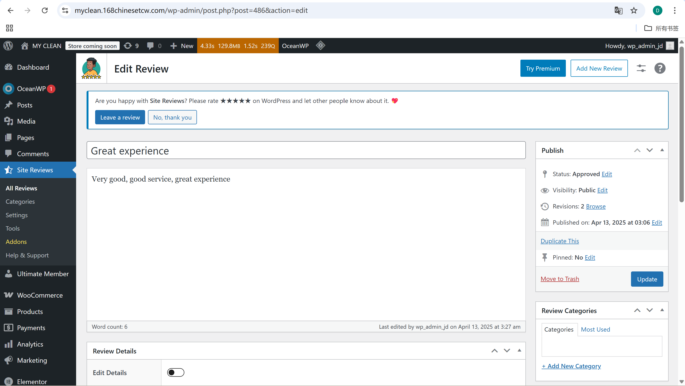
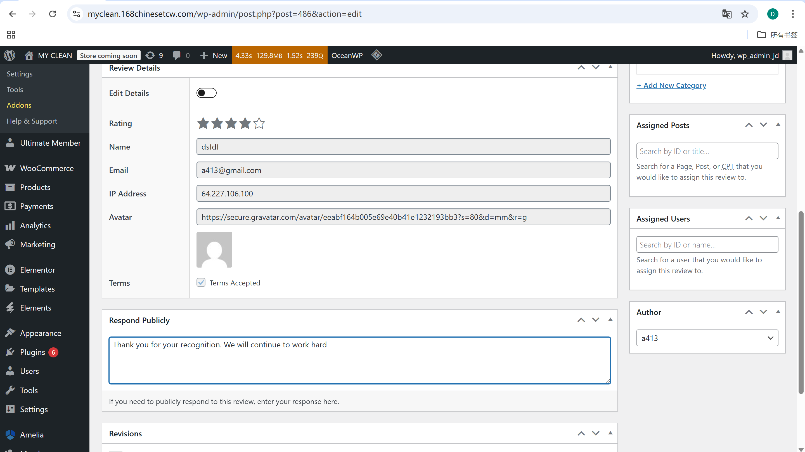
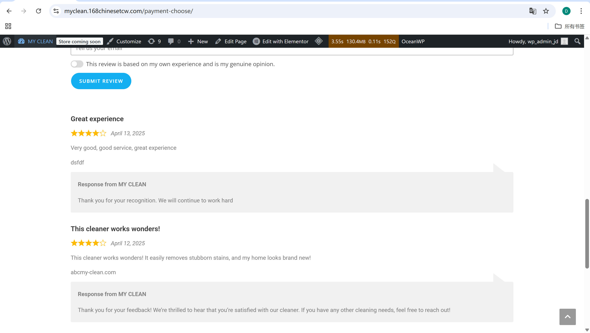

# User Story Title: Cleaner Reply to Customer Review  
Other versions: Cleaner responds to feedback to improve trust  

---

## Priority: 8  
MoSCoW Category: Could-Have  
Iteration: Iteration 2  
This feature allows cleaners to respond publicly to customer reviews, enhancing communication and professionalism.

---

## Estimation: 2 days  
Developer: Yandong Jiang  
Estimated time: 2 days  

---

## Assumptions:
- Only cleaners can reply to reviews received on their completed bookings  
- Replies are public and shown below the original review  
- Admin may moderate or remove replies if necessary  
- Replies are submitted through the WordPress backend  

---

## Description:

### Description-v1:  
As a cleaner, I want to respond to customer reviews, so that I can thank them or clarify any issues to maintain a good reputation.

### Description-v2 (after planning):  
Cleaners can:
- View all customer reviews related to their services  
- Write a reply from the WordPress Site Reviews backend  
- Have their response appear under the review on the public booking page  
- Express appreciation or explain misunderstandings

---

## Tasks (See Chapter 4):
1. Enable cleaner access to Site Reviews replies section – 0.5 day  
2. Add response field in backend UI (meta box) – 0.5 day  
3. Connect reply to correct frontend display below the review – 0.5 day  
4. Verify customer-review-cleaner linkage for correct reply association – 0.5 day  

---

## UI Design:

**Reply Interface in Backend**  
Cleaners can add a public response under the review via the Site Reviews admin panel.  
Screenshot:  

---

**Reply Entry and Response**  
The reply is stored and shown clearly with name and context.  
Screenshot:  

---

**Review Display on Public Page**  
Customer’s review with cleaner’s official reply visible for transparency.  
Screenshot:  

---

## Completed:
- [x] Cleaners can submit public replies to reviews  
- [x] Replies appear below reviews on the public booking/feedback page  
- [x] Admin can edit or remove replies  
- [x] Markdown file and screenshots stored properly

