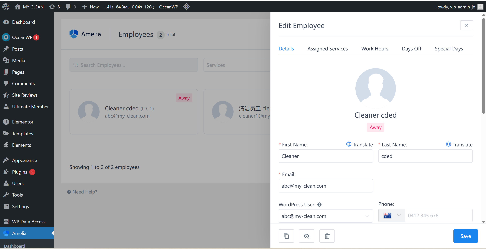
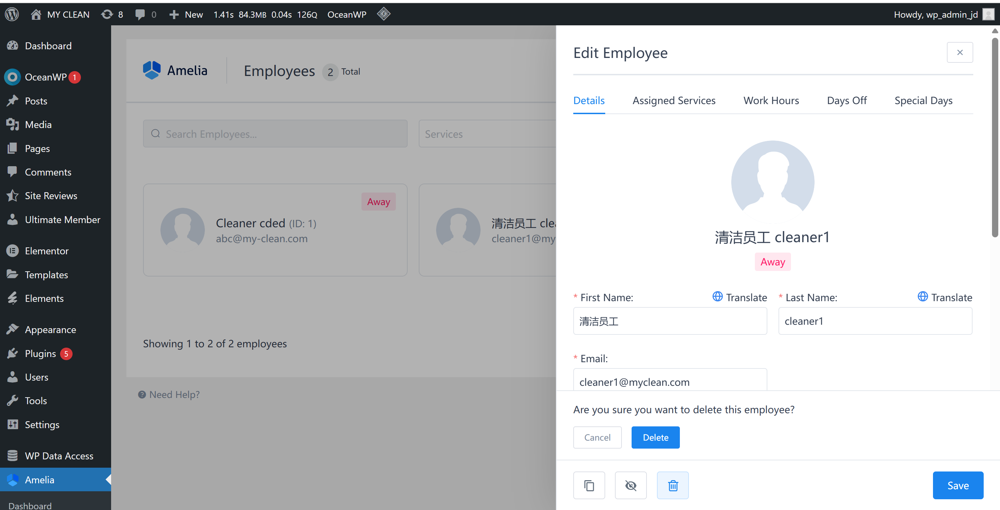
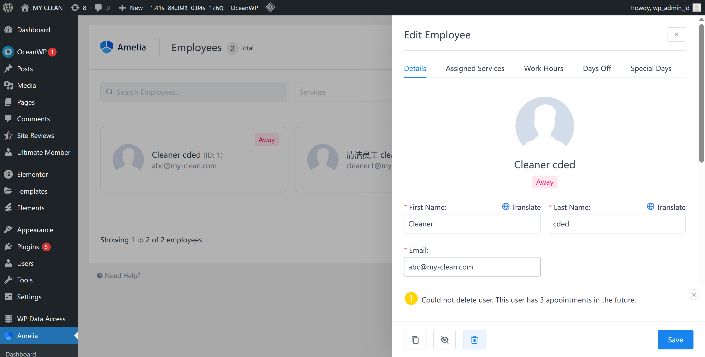

# User Story Title: Admin Verifies Cleaners  
Other versions: Admin approval, Cleaner eligibility control  

---

## Priority: 1  
MoSCoW Category: Must-Have  
Iteration: Iteration 1  
Ensures only approved and verified cleaners can provide services, maintaining quality and trust.

---

## Estimation: 4 days  
Developer: Yandong Jiang  
Estimated time: 4 days  

---

## Assumptions:
- Cleaners must complete profile info before being verified  
- Admin can view/edit/delete cleaner info from dashboard  
- Verified status enables cleaner to accept bookings  
- System prevents deletion if cleaner has future appointments  
- Admin panel is secured and accessible only with admin role  

---

## Description:

### Description-v1:  
As an admin, I want to verify and approve cleaners before they can accept bookings, so that I can ensure service quality and professionalism.

### Description-v2 (after planning):  
Admin users can:  
- View a list of all cleaners from the dashboard  
- Edit cleaner profile (name, contact info, description)  
- Set status as "Away", "Active" or "Pending Approval"  
- Delete cleaner if they have no future appointments  
- Receive validation message if deletion is blocked  
- Prevent unverified cleaners from appearing to customers  

---

## Tasks (See Chapter 4):
1. Create admin dashboard for employee list – 0.5 day  
2. Enable profile editing and status update – 1 day  
3. Restrict bookings to verified cleaners – 1 day  
4. Add deletion check (block if future bookings exist) – 1 day  
5. UI alert when deletion is not allowed – 0.5 day  

---

## UI Design:

**Cleaner List + Admin Access**  
Admin panel showing all registered cleaners.

Screenshot:  

---

**Deletion Attempt - Confirm Dialog**  
Admin prompted to confirm deletion.

Screenshot:  

---

**Deletion Blocked if Appointments Exist**  
System warns if cleaner still has future bookings.

Screenshot:  

---

## Completed:

- [x] Cleaner list visible to admin  
- [x] Editable profile panel implemented  
- [x] Verification status affects cleaner’s access  
- [x] Deletion blocked if future jobs assigned  
- [x] Screenshots saved to `images/` for documentation  

---

Website URL for live version:  
https://myclean.168chinesetcw.com/employee/

---

