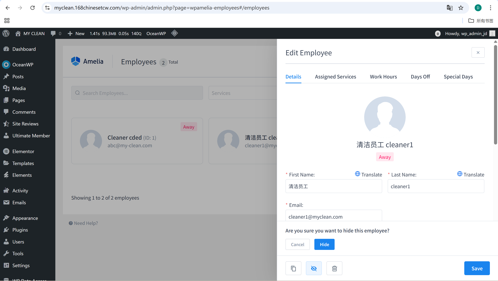
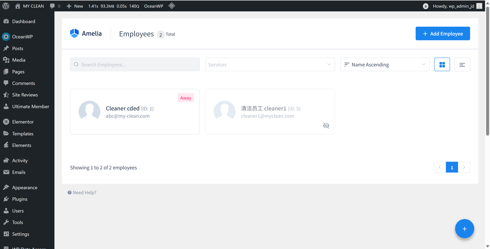
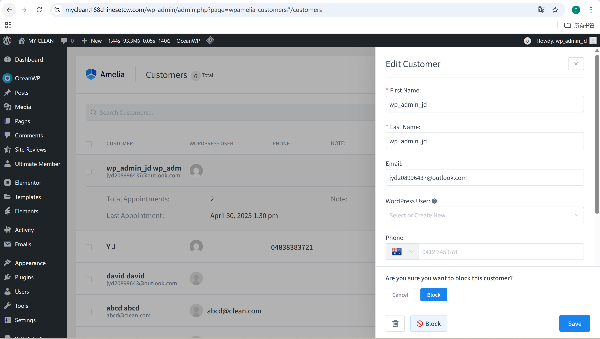
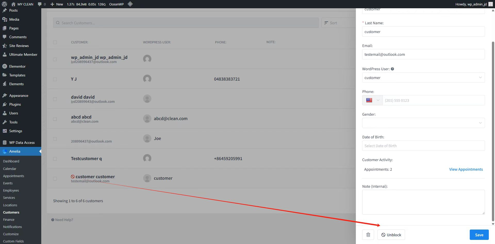

# User Story Title: Suspend or Ban Users  
Other versions: Block customers or cleaners who violate rules  

---

## Priority: 16  
MoSCoW Category: Should-Have  
Iteration: Iteration 2  
Allows administrators to suspend or ban problematic users (cleaners/customers), maintaining platform integrity and safety.

---

## Estimation: 2 days  
Developer: Yandong Jiang  
Estimated time: 2 days  

---

## Assumptions:
- Only admins can suspend/ban accounts  
- Suspended users cannot log in or book/accept appointments  
- Banned users must be manually unblocked by admin  
- Reasons for suspension should be recorded for audit purposes  

---

## Description:

### Description-v1:  
As an admin, I want to suspend or ban users/cleaners who violate platform rules, so that the platform remains safe and trustworthy.

### Description-v2 (after planning):  
Admin has the ability to:  
- Hide or suspend cleaners (temporarily disable them)  
- Block customer accounts (stop them from booking)    
- Reactivate previously suspended accounts when needed  

---

## Tasks (See Chapter 4):
1. Add “Block/Unblock” button to customer profile – 0.5 day  
2. Add “Hide” button to cleaner profile (UI + logic) – 0.5 day  
3. Prevent blocked users from accessing booking functions – 0.5 day  
4. Display ban status on admin dashboard – 0.5 day  

---

## UI Design:

**Cleaner Hide Function**  
Admins can hide a cleaner from the platform to prevent booking assignments.

Screenshot:  

---

**Cleaner Hidden in List View**  
Hidden cleaners are grayed out and unselectable in the system.

Screenshot:  

---

**Block Customer (Confirmation)**  
Admins confirm block action when a customer violates rules.

Screenshot:  

---

**Unblock Customer**  
Allows restoring previously blocked customer accounts.

Screenshot:  

---

## Completed:

- [x] Admin can suspend or hide cleaners  
- [x] Admin can block/unblock customers  
- [x] Suspended users cannot access booking  
- [x] Screenshots stored in `images/` and markdown saved in `user_stories/`  

---

