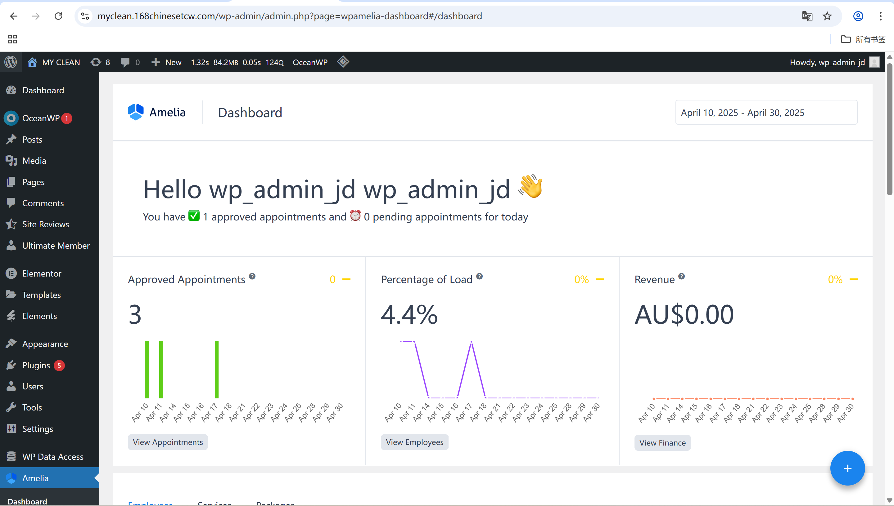
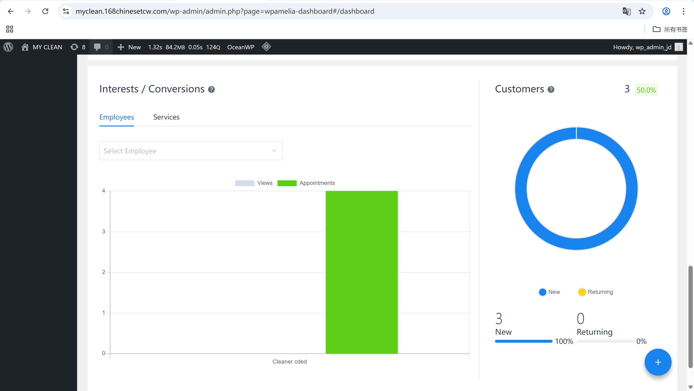

# User Story Title: Admin Dashboard Reports  
Other versions: Booking stats, Revenue monitoring, User analytics

---

## Priority: 17  
MoSCoW Category: Should-Have  
Iteration: Iteration 2  
Allows admins to view operational data reports (e.g., bookings, revenue, user activity) via the dashboard for better decision-making and platform management.

---

## Estimation: 4 days  
Developer: Yandong Jiang  
Estimated time: 4 days  

---

## Assumptions:
- Dashboard data is automatically updated with live system usage  
- Admin access only (not visible to cleaners or customers)  
- Metrics include appointment volume, user stats, and income reports  
- Charts and summaries can be filtered by date ranges  

---

## Description:

### Description-v1:  
As an admin, I want to view data reports (bookings, revenues, active users), so that I can make informed decisions about platform operations.

### Description-v2 (after planning):  
Admins can:  
- Access dashboard from Amelia plugin in WP-Admin  
- View summary of approved appointments, revenue and workload  
- Access detailed reports on employees, services, customers  
- View charts on daily appointments, load %, and user breakdown  
- Use the dashboard to monitor platform health and user behavior  

---

## Tasks (See Chapter 4):
1. Display booking statistics (bar graph per day) – 1 day  
2. Display revenue summaries per period – 0.5 day  
3. Show customer breakdown (new vs returning) – 0.5 day  
4. View reports per employee (conversion % / usage) – 1 day  
5. Style charts and integrate with dashboard UI – 1 day  

---

## UI Design:

**Admin Dashboard Summary Panel**  
Shows key metrics: appointments, revenue, workload.

Screenshot:  

---

**Customer Conversion Report**  
Breakdown of new vs returning users + employee report.

Screenshot:  

---

## Completed:

- [x] Dashboard displays core metrics  
- [x] Revenue and appointment stats implemented  
- [x] Pie chart for customer types integrated  
- [x] Charts styled and date range filter added  
- [x] Screenshots saved in `images/` folder  

---

Website URL for live version:  
https://myclean.168chinesetcw.com/wp-admin/admin.php?page=wpamelia-dashboard#/dashboard
